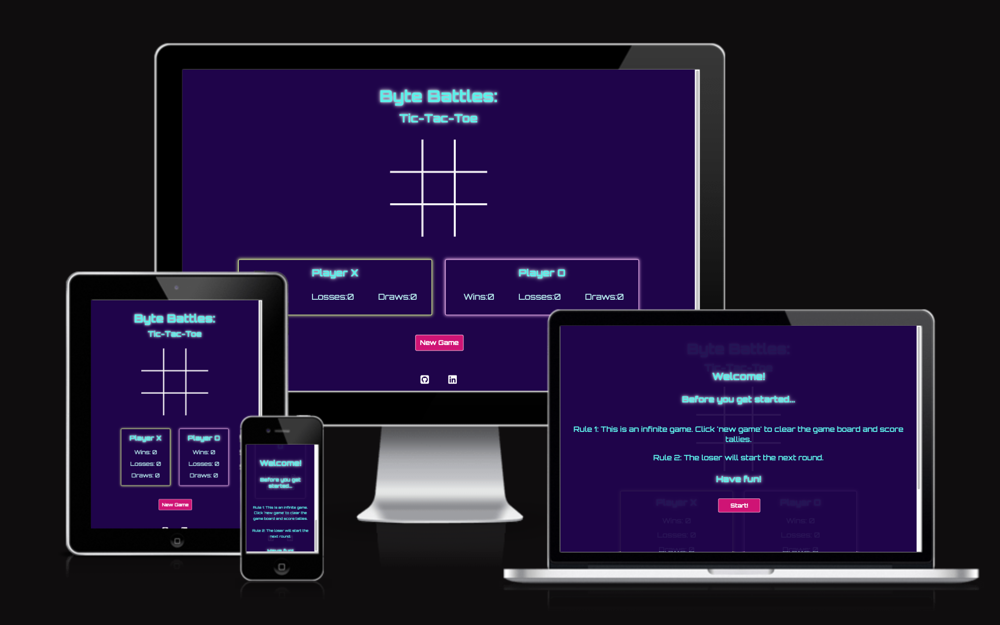
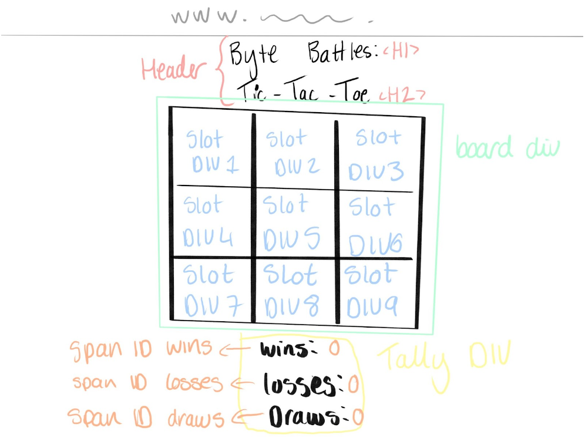
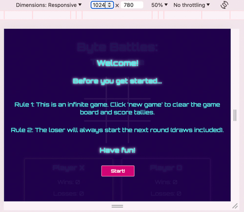
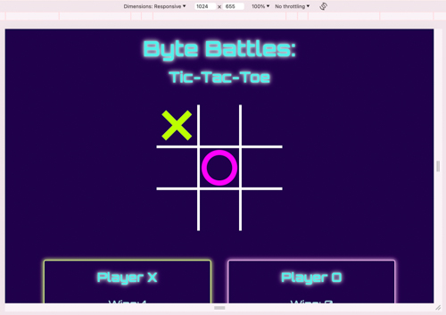
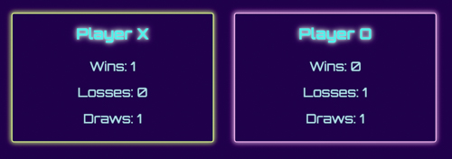
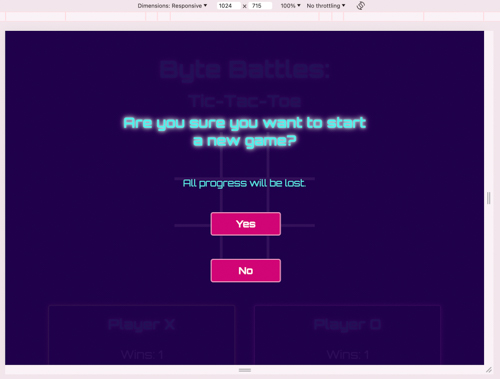
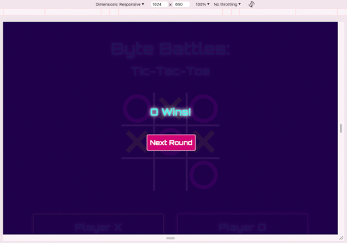
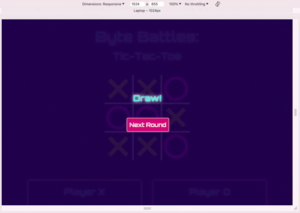

# **Battle Bytes: Tic-Tac-Toe**

## **Introduction**

Battle Bytes: Tic-Tac-Toe is a retro-style tic-tac-toe game that can be played as a single or multiplayer game from one device.

> **Note:** Please cmd-click (Mac) or ctrl-click(Windows) on any links to open them in a new tab.

Link to live website: 
https://maevecrossan.github.io/byte-battles/

Testing can be found in a separate file here: 
[TESTING.md](TESTING.md)

## UX
### Target Audiences

* Casual Gamers of all ages looking for something non-commital, quick to understand and playable across multiple devices.

* Children who want something colourful, easy to learn, and that they can play with their friends.

* Those who enjoy puzzles, who want something easy to pick up and pass the time with. 

* Those looking to develop logical thinking skills such as younger students and teachers.

* Retro game enjoyers who enjoy simple design and nostalgic gaming.

### User Stories

As a user...
* I want to pass the time playing a nostalgic game.
* I want to play a game with a fun and clutter-free environment.
* I want to play a game with clear rules and logic.
* I want to play a game that behaves predictably.
* I want to play a game that counts the scores accurately.
* I want a game that I can play for a long time without any hiccups.

As a business...
* I want to establish myself in players' minds through retro-inspired game style.
* I want to build trust with users by providing a predictable, high-quality experience.
* I want to create games that users enjoy playing and looking at so that they return frequently.
* I want users to have a pleasant experience and not be confused by any functionality or instructions.

### Opportunities

| Opportunities | Importance | Viability/Feasibility |
|-----|:-----:|:-----:|
| Create solo AND multiplayer tic-tac-toe game | 5 | 5 |
| Create score tallies for both players to monitor progress | 5 | 5 |
| Create alternative colour schemes | 2 | 2 |
| Create a player vs CPU game | 3 | 1 |
| Allow players to choose shapes other than 'X' and 'O' | 1 | 2 |
| Create additional retro games (e.g. snake) | 1 | 1 |

I wanted to create more features for this game, as well as additional games to flesh out the website and give players more options. However, I was limited by time to learn how to create these features, and secondly how to implement them accurately.
I discuss the features I would like to add in the 'future developments' section found at the end of this file.

### Wireframe Mockup
Below is the initial sketch I created using Procreate on my iPad. Once the game logic had been fully thought out, however, the final appearance had changed.
For example, what was originally one tally became two. I also decided not to use alerts and instead use hidden divs so I could maintain the aesthetic consistent. 

## Features

### General

Across all screen sizes, the content will be aligned in the centre. This includes the hidden messages.
All body text is blue, and all buttons are pink with white text. The X's are green when placed on the board, corresponding to the green glow around player X's tally. Player O has the same features but in pink.
On all devices, the footer sticks to the bottom and houses two social media links. Both links open in new tabs and link to my personal profiles.

#### Content Layout

Below are screenshots of how the content is displayed. The screenshots are taken on a 1024px screen. An in-depth look at how the content responds on different devices can be found in the testing section.

##### The Welcome Message

##### The Game Board

##### The Score Tallies

##### The New Game Button

##### Social Media Links (footer)

##### The Next Round Button

##### The Warning Message

##### The Win Message

##### The Draw Message

#### Colour Palette

Following is an overview of all the colours used in this project. Every colour combination received a minimum of an AA rating.

> **Note:** A detailed breakdown of the colours used together can be found in the testing file.

| Colour Name | Codes | Use |
|-----|:-----:|:-----:|
| Purple | #1f004b/rgb(31, 0, 75) | Page background |
| White | #ffffff/rgb(255, 255, 255) | Button text |
| Pink | #d10575/rgb(209, 5, 117) | Button background |
| Bright Green | #bbff00/rgb(187, 255, 0) | Player X |
| Bright Pink | #ff00fb/rgb(255, 0, 251)| Player O |
| Bright Blue | #54efea/rgb(84, 239, 234) | Body text |

#### Typography

There is only one font used in this project. 'Orbitron' was downloaded from Google Fonts. Depending on its location, varying font weights were added to help readability. I chose this retro, arcade-like font to add another layer of nostalgia to the project.
A glow was also added to the larger text to emulate a neon effect and to provide visual differentiation. 

## Testing

Testing was moved into a separate file for clarity. It can be found here: [TESTING.md](TESTING.md).

> **Note:** Please cmd-click (Mac) or ctrl-click(Windows) on any links to open them in a new tab.

## Future Developments

There are several ways in which I think this project could be improved upon had time not been a factor. While I am happy with the minimal viable product, I feel additional features could be added to make the game more enjoyable and customisable. 

1. Firstly, I would like to give the user the ability to choose their username. 

2. I would like to introduce a pre-game menu where the user can pick an alternative character to the traditional 'X' and 'O'. I feel as though this could also provide an opportunity to increase brand awareness by creating unique characters that people could then associate with the game.

3. I would also like to add a true multiplayer feature where a link can be sent to invite another player on another device to the game.

4. Another feature that I would like to add is a scoreboard that remembers previous games. Friends can create private games and keep revisiting them to add to the scoreboard. 

5. I would like to include a theme-changer. I understand that gamers enjoy different aesthetics and play in varying environments, so I feel giving them the option to change the theme would be a welcomed feature.

6. Another feature I would like to add is a sound effects toggle. Some players like to have sound effects, while others don't. I think adding small sound effects for when slots are clicked or a new game is started could add more interactivity to the game.