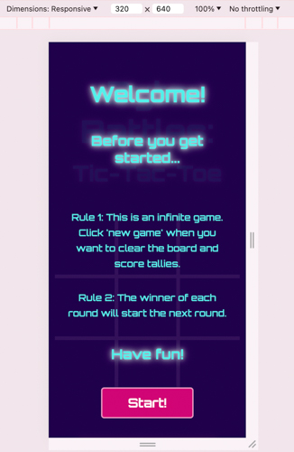
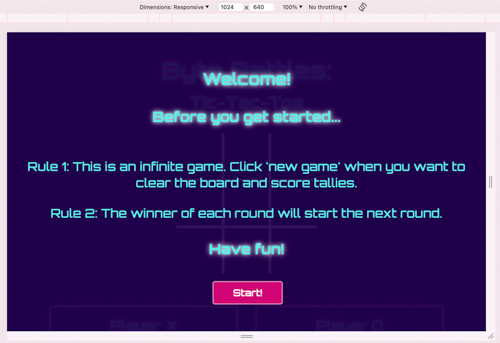
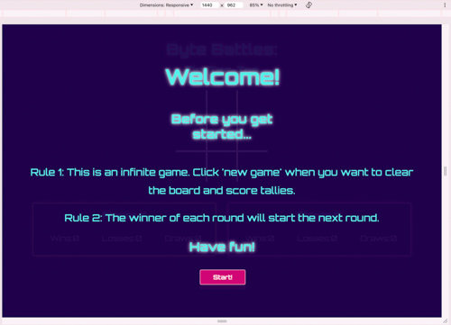
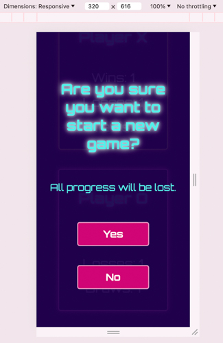
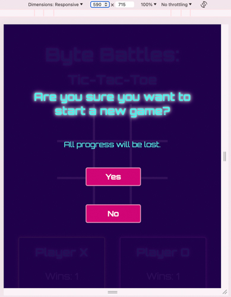
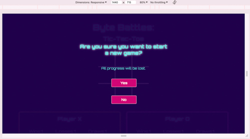
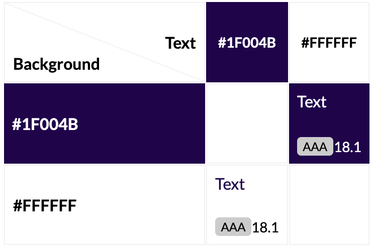
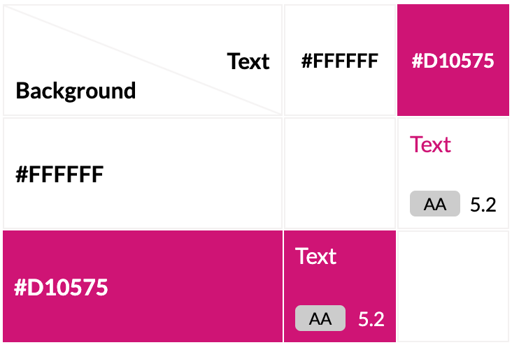

# **Battle Bytes: Tic-Tac-Toe**

## **Introduction**

Battle Bytes: Tic-Tac-Toe is a retro-style tic-tac-toe game that can be played as both a single or multiplayer game.

> **Note:** Please cmd-click (Mac) or ctrl-click(Windows) on any links to open them in a new tab.

Link to live website: 
https://maevecrossan.github.io/byte-battles/

## UX
### Target Audiences

* Casual Gamers of all ages looking for something non-commital, quick to understand and playable across multiple devices.

* Children who want something colourful, easy to learn, and that they can play with their friends.

* Those who enjoy puzzles who want something easy to pick up and pass the time with. 

* Those looking to develop logical thinking skills such as younger students and teachers.

* Retro game enjoyers who enjoy simple game design and nostalgic gaming.

### User Stories

As a user...
* I want to pass the time playing a nostalgic game.
* I want to play a game with a unique but clutter-free environment.
* I want to play a game with clear rules and logic.
* I want to play a game that behaves logically.
* I want to play a game that counts the scores accurately.
* I want a game that I can play for a long time without any hiccups.

As a business...
* I want to establish myself in the minds of players through retro inspired game style.
* I want to build trust with users by providing predictable, high-quality games.
* I want to create games that users enjoy playing and looking at so that they return frequently.
* I want users to have a pleasant experience and not be confused by any functionality or instructions.

### Opportunities

| Opportunities | Importance | Viability/Feasibility |
|-----|:-----:|:-----:|
| Create solo AND multiplayer tic-tac-toe game | 5 | 5 |
| Create score tallies for both player to monitor progress | 5 | 5 |
| Create alternative colour schemes | 2 | 2 |
| Create a player vs CPU game | 3 | 1 |
| Allow players to choose shapes other than 'X' and 'O' | 1 | 2 |
| Create additional retro games (e.g. snake) | 1 | 1 |

### Wireframe Mockup
Below is the initial sketch I created using Procreate on my iPad. Once the game logic had been fully thought out, however, the final appearance had changed.
For example, what was originally one tally became two. I also decided to not use alerts and instead use hidden divs so I could maintain the aesthetic consistent. 

## Features

### General

Across all screen sizes, the content will be aligned in the centre. This includes the hidden messages.
All body text is blue, and all buttons are pink with white text. The X's are green when placed on the board, corresponding to the green glow around player X's tally. Player O has the same features but in pink.

#### Colour Palette

This is an overview of all the colours used in this project. Every colour combination received at minimum an AA rating.

> **Note:** A detailed breakdown of the colours used together can be found in the testing section

| Colour Name | Codes | Use |
|-----|:-----:|:-----:|
| Purple | #1f004b/rgb(31, 0, 75) | Page background |
| White | #ffffff/rgb(255, 255, 255) | Button text |
| Pink | #d10575/rgb(209, 5, 117) | Button background |
| Bright Green | #bbff00/rgb(187, 255, 0) | Player X |
| Bright Pink | #ff00fb/rgb(255, 0, 251)| Player O |
| Bright Blue | #54efea/rgb(84, 239, 234) | Body text |

#### Typography

There is only one font used in this project. 'Orbitron' was downloaded from Google Fonts. Depending on its location, varying font weights were added to help readability. I chose this retro, arcade-like font to add another layer of nostalgia to the project.
A glow was also added to the larger text to emulate a neon effect and to provide visual differentiation. 

#### Content Layout------------

Below are a series of screenshots demonstrating how the hidden messages are displayed among the varying size screens. As you will see in a moment, I chose to make the game responsive based on four different screen sizes: 
* 320px (mobile) 
* 590px (small tablet) 
* 1024px (small laptops)
* 1440px (large screens) and up

The choice of screensize parameters laid out above will be explained in the game features section. 

##### Welcome Message

1. Mobile

2. Small tablet and up (590px)

3. Small laptops and up (1024px)

4. Large Screens (1440px)

##### Warning Message

1. Mobile

2. Small tablet and up (590px)

3. Small laptops and up (1024px)

4. Large Screens (1440px)

##### Win Message

1. Mobile

2. Small tablet and up (590px)

3. Small laptops and up (1024px)

4. Large Screens (1440px)

##### Draw Message

1. Mobile

2. Small tablet and up (590px)

3. Small laptops and up (1024px)

4. Large Screens (1440px)

### Game Features
Regardless of screen size, the game displays the game board, two player tallies and a 'new game' button. 

#### Game Board

1. Mobile

2. Small tablet and up (590px)

3. Small laptops and up (1024px)

4. Large Screens (1440px)

#### Score Tally
As mentioned above, I opted for those four screen parameters out of consideration for the player. Where possible I wanted to avoid the player needing to scroll excessively to see their scores. 
Below, you will see how the tallies progressively stretch horizontally to make use of the bigger screen size. I wanted to avoid vertical movement and much as I could, so I chose the second screensize to be 590px. 

1. Mobile

2. Small tablet and up (590px)

3. Small laptops and up (1024px)

4. Large Screens (1440px)

#### New Game Button

#### Next Round Button

## Testing
### Developmental Testing

### Post Developmental Testing
#### Validator Testing
##### W3C 

No errors were found when checked with the W3C HTML Validator.

https://validator.w3.org/nu/?doc=https%3A%2F%2Fmaevecrossan.github.io%2Fbyte-battles%2F

No errors were found when checked with the W3C CSS Validator.

https://jigsaw.w3.org/css-validator/validator?uri=https%3A%2F%2Fmaevecrossan.github.io%2Fbyte-battles%2F&profile=css3svg&usermedium=all&warning=1&vextwarning=&lang=en

#### Lighthouse 

No performance or accessibility issues were found when checked with Lightouse in chrome devtools.

**Mobile Test**

**Desktop Test**

#### Contrast Grid

Below is an overview of all the colours used in this project. All colours received a AA or AAA rating.

The following is a detailed showing of the colour combinations used in this project.

1. Blue text (#54efea) on purple background (#1f004b).

2. Green player X (#bbff00) on purple background (#1f004b).

3. Pink player O (#ff00fb) on purple background (#1f004b).

4. White game grid (#ffffff) on purple background (#1f004b).

5. Pink button (#d10575) with white text (#ffffff).

