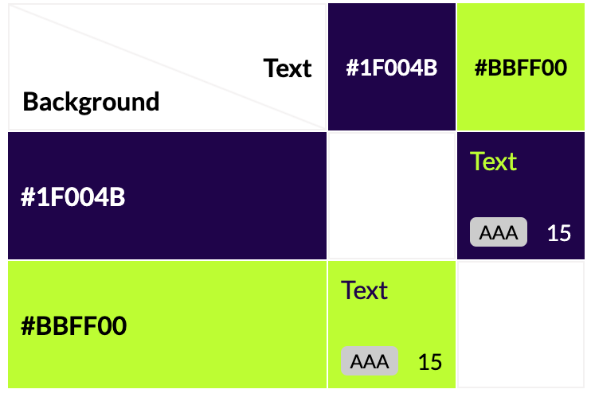

# **Battle Bytes: Tic-Tac-Toe**

## **Introduction**

Battle Bytes: Tic-Tac-Toe is a retro-style tic-tac-toe game that can be played as both a single or multiplayer game.

> **Note:** Please cmd-click (Mac) or ctrl-click(Windows) on any links to open them in a new tab.

Link to live website: 
https://maevecrossan.github.io/byte-battles/

## UX
### Target Audiences

* Casual Gamers of all ages looking for something non-commital, quick to understand and playable across multiple devices.

* Children who want something colourful, easy to learn, and that they can play with their friends.

* Those who enjoy puzzles who want something easy to pick up and pass the time with. 

* Those looking to develop logical thinking skills such as younger students and teachers.

* Retro game enjoyers who enjoy simple game design and nostalgic gaming.

### User Stories

As a user...
* I want to pass the time playing a nostalgic game.
* I want to play a game with a unique but clutter-free environment.
* I want to play a game with clear rules and logic.
* I want to play a game that behaves logically.
* I want to play a game that counts the scores accurately.
* I want a game that I can play for a long time without any hiccups.

As a business...
* I want to establish myself in the minds of players through retro inspired game style.
* I want to build trust with users by providing predictable, high-quality games.
* I want to create games that users enjoy playing and looking at so that they return frequently.
* I want users to have a pleasant experience and not be confused by any functionality or instructions.

### Opportunities

### Wireframe Mockup

## Features

### General
##### The Logo / Title

#### Colour Palette

#### Typography

#### Content Layout

### Game Features
#### Game Board

#### Score Tally

#### New Game Button

#### Next Round Button

## Testing
### Developmental Testing

### Post Developmental Testing
#### Validator Testing
##### W3C 

No errors were found when checked with the W3C HTML Validator.

https://validator.w3.org/nu/?doc=https%3A%2F%2Fmaevecrossan.github.io%2Fbyte-battles%2F

No errors were found when checked with the W3C CSS Validator.

https://jigsaw.w3.org/css-validator/validator?uri=https%3A%2F%2Fmaevecrossan.github.io%2Fbyte-battles%2F&profile=css3svg&usermedium=all&warning=1&vextwarning=&lang=en

#### Lighthouse 

No performance or accessibility issues were found when checked with Lightouse in chrome devtools.

**Mobile Test**

**Desktop Test**

#### Contrast Grid

Below is an overview of all the colours used in this project. All colours received a AA or AAA rating.

The following is a detailed showing of the colour combinations used in this project.

1. Blue text (#54efea) on purple background (#1f004b).

2. Green player X (#bbff00) on purple background (#1f004b).

3. Pink player O (#ff00fb) on purple background (#1f004b).

4. White game grid (#ffffff) on purple background (#1f004b).
