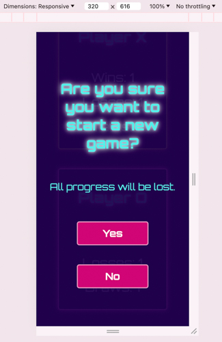
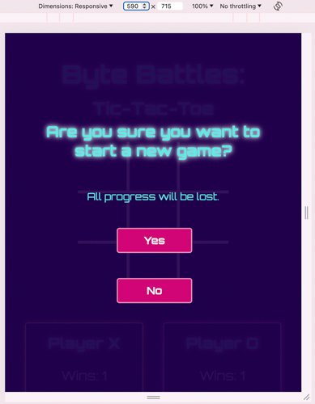
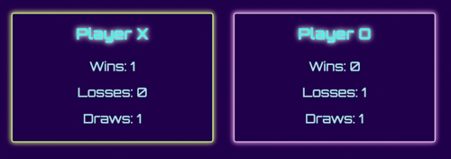
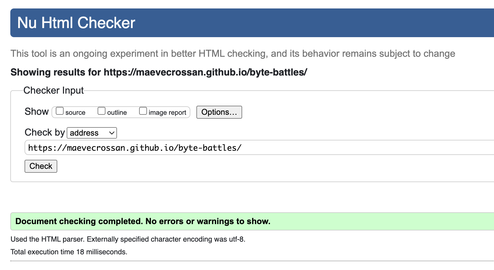

# **Battle Bytes: Tic-Tac-Toe**

## **Testing**

### Developmental Testing

The following section explains the steps taken and aspects considered during the development process.

#### Responsiveness

I designed for mobiles first, using 320px as my starting point. I then progressed to 590px, 1024px and 1440px. I chose these incremenents largely due to the layout out the player tally.
I wanted to avoid the player scrolling as much as possible, so when possible, I decided to make the tally boxes to expand horizontally. 

Below are a series of screenshots demonstrating how the content is displayed across four aforementioned screen sizes. As you will see, all content is centered. This was done so that if two players were playing, both players could see the game board and their respective tallies easily. The centered content would also allows for additional features to be displayed along the sides, such as scoreboard, game settings, etc.

The responsiveness of each element was tested immediately and repeatedly after styling each element.

##### Welcome Message

1. Mobile

2. Small tablet and up (590px)

3. Small laptops and up (1024px)

4. Large Screens (1440px)

##### Warning Message

1. Mobile

2. Small tablet and up (590px)

3. Small laptops and up (1024px)

4. Large Screens (1440px)

##### Win Message

1. Mobile

2. Small tablet and up (590px)

3. Small laptops and up (1024px)

4. Large Screens (1440px)

##### Draw Message

1. Mobile

2. Small tablet and up (590px)

3. Small laptops and up (1024px)

4. Large Screens (1440px)

##### Social Media Links (footer)

1. Mobile

2. Small tablet and up (590px)

3. Small laptops and up (1024px)

4. Large Screens (1440px)

#### Game Features
Regardless of screen size, the page displays the game board, two player tallies and a 'new game' button. The size of the screen affects how each element will be displayed as you will see below.

##### Game Board

1. Mobile

2. Small tablet and up (590px)

3. Small laptops and up (1024px)

4. Large Screens (1440px)

##### Score Tallies
As mentioned above, I opted for those four screen parameters out of consideration for the player. Where possible I wanted to avoid the player needing to scroll excessively to see their scores. 

Below, you will see how the tallies progressively stretch horizontally to make use of the bigger screen size. I wanted to avoid vertical movement and much as I could, so I chose the second screensize to be 590px. 

1. Mobile

2. Small tablet and up (590px)

3. Small laptops and up (1024px)

4. Large Screens (1440px)

##### New Game Button
Below is the 'new game' button. It's appearance is maintained across all screen sizes and is always found beneath the player tallies.

##### Next Round Button
Below is the 'next round' button. Its appearance is maintained across all screen sizes. It is only found in the 'draw' and 'win' messages.

##### Colour Contrast Grid

The colours used in this project were chosen early in development. The vibrant and contrasting colours were helpful when styling the elements, so the colour combinations were tested early.

Following is an overview of all the colours used in this project. Every colour combination received a minimum of an AA rating.

| Colour Name | Codes | Use |
|-----|:-----:|:-----:|
| Purple | #1f004b/rgb(31, 0, 75) | Page background |
| White | #ffffff/rgb(255, 255, 255) | Button text |
| Pink | #d10575/rgb(209, 5, 117) | Button background |
| Bright Green | #bbff00/rgb(187, 255, 0) | Player X |
| Bright Pink | #ff00fb/rgb(255, 0, 251)| Player O |
| Bright Blue | #54efea/rgb(84, 239, 234) | Body text |

The following is a detailed comparison of the colour combinations used in this project.

1. Blue text (#54efea) on purple background (#1f004b).

2. Green player X (#bbff00) on purple background (#1f004b).

3. Pink player O (#ff00fb) on purple background (#1f004b).

4. White game grid (#ffffff) on purple background (#1f004b).

5. Pink button (#d10575) with white text (#ffffff).

### Post Developmental Testing
#### Validator Testing
##### W3C

No errors were found when checked with the W3C HTML Validator.

https://validator.w3.org/nu/?doc=https%3A%2F%2Fmaevecrossan.github.io%2Fbyte-battles%2F

No errors were found when checked with the W3C CSS Validator.

https://jigsaw.w3.org/css-validator/validator?uri=https%3A%2F%2Fmaevecrossan.github.io%2Fbyte-battles%2F&profile=css3svg&usermedium=all&warning=1&vextwarning=&lang=en

##### JS Hint

Some warnings were noted in JS Hint. Below, however, is a screenshot of JS Hint upon project completion. There were, however, initial warnings that are discussed in the bugs and fixes section below.

#### Lighthouse 

No performance or accessibility issues were found when checked with Lightouse in chrome devtools.

**Mobile Test**

**Desktop Test**

#### Performance Testing

I tested how the content would appear and how the game performed using the following devices:

* iPhone 14 Pro Max: 2796px x 1290px
* iPad Pro: 2732px x 2048px
* Macbook Pro: 2880px x 1800px
* BenQ EL2870U Display: 3840px x 2160px

### Bugs and Fixes

There were several bugs encountered during the development of this project. The bugs primarily happened when writing the JavaScript.

#### 1. 'boardSlots' not defined.

This error occured once the X's and O's were created with CSS and the event listeners were added to the board slots. The issue was fixed by defining the board slots in the relevant functions. 

The variable was later added to the global scope to prevent repetition and  confusing syntax. Below you can see the slot event working correctly.

#### 2. The current player was not switching from X to O.

As you can see from above, the player was not switching after occupying a slot. 
I began firstly by fixing the drawResult function (error seen in log above). I think checked that the function had been fixed and to see if it had affected the player swapping function.

It seemed as though the ternary operator wasn't alteranting and reassigning the currentPlayer properly. 

The error came from using the wrong name (playerX and playerO). I replaced the name with the correct one ('x' and 'o').

#### 3. The characters stopped visually swapping.

The console as logging that the players were corrrectly alternating, however this was not being represented visually after a few clicks. I tested a few times to check the error.

A second test to confirm there was an error. 

I updated the code to explicitly changed characters by toggling between playerX and playerO classes, which fixed the issue.

#### 4. O points not incrementing.

After creating the functions to increment the scores, I began testing them but found the scores for playerO were not incrementing.

Below is a screenshot of the O losses not incrementing.

I then tested to see if the same issue was happening for the wins, which it was.

The issue was fixed with a simple change from 'player' to 'currentPlayer' in parentheses after the addWinPoint function name. The mistake was having a knock-on effect and causing the other functions to stop working.

#### 5. Only X's showing.

When starting a new game after a win, only X's showed on the board.

I checked to see what the console was logging and added console log to function. I then checked again to see if the error only occured when a new round began, and to see if the console was logging the next round correctly.

Before rewriting anything, I tested to see if the error occured after both wins and draws, which it did. 

To fix the problem, I wanted to tidy up the console as it was getting cluttered and increasingly difficult to follow. I felt it was no longer needed to log if the 'combo' checks. 

I realised that one little line of code was causing the error, and after removing that one line, the problem was fixed. 

The updated code:

I then tested for the error through a win and a draw, both logging no errors and switching correctly once again.

#### 6. Unused Variables Warning (JS Hint)

As mentioned previosuly, JS Hint pointed out a few problems when first checking my code. The first issues I tackled were the unused variables.  

I rewrote the function to be a little tidier and removed the unused variables.

#### 7. Event listeners in loops.

JS Hint also warned that having event listeners within loop could cause confusion. The fix here was simple - I removed the event listeners from the loops. The one causing the largest error and impacting most functions was the one concerning the DOM content. 

Below , you can see how the board slot event listener is now in it's own function (line 24).

