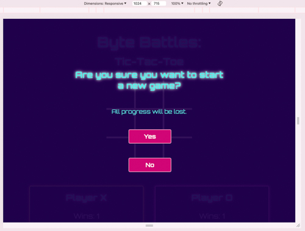
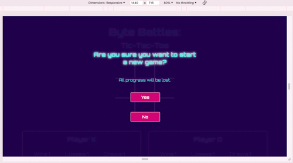
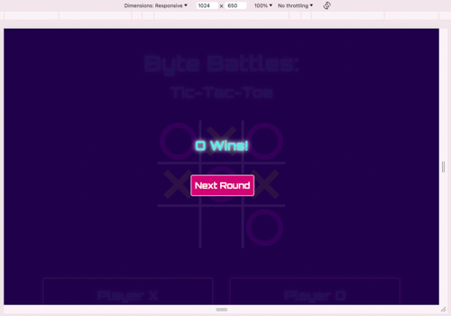
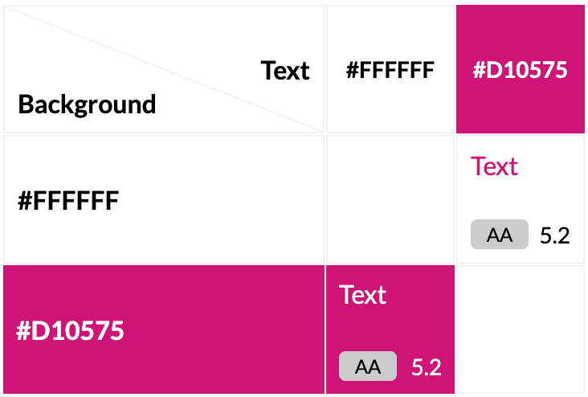
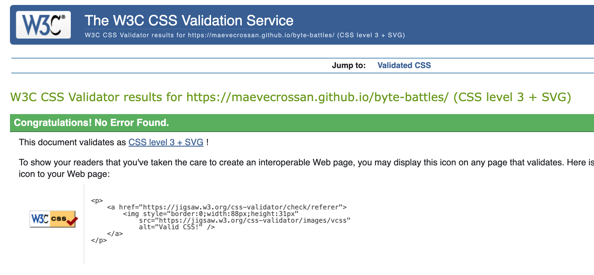

# **Battle Bytes: Tic-Tac-Toe**

## **Testing**

### Responsiveness

Below are a series of screenshots demonstrating how the hidden messages are displayed among the varying size screens. As you will see in a moment, I chose to make the game responsive based on four different screen sizes: 
* 320px (mobile) 
* 590px (small tablet) 
* 1024px (small laptops)
* 1440px (large screens) and up

The choice of screensize parameters laid out above will be explained in the game features section. 

#### Welcome Message

1. Mobile

2. Small tablet and up (590px)

3. Small laptops and up (1024px)

4. Large Screens (1440px)

#### Warning Message

1. Mobile

2. Small tablet and up (590px)

3. Small laptops and up (1024px)

4. Large Screens (1440px)

#### Win Message

1. Mobile

2. Small tablet and up (590px)

3. Small laptops and up (1024px)

4. Large Screens (1440px)

#### Draw Message

1. Mobile

2. Small tablet and up (590px)

3. Small laptops and up (1024px)

4. Large Screens (1440px)

### Game Features
Regardless of screen size, the page displays the game board, two player tallies and a 'new game' button. The size of the screen affects how each element will be displayed as you will see below.

#### Game Board

1. Mobile

2. Small tablet and up (590px)

3. Small laptops and up (1024px)

4. Large Screens (1440px)

#### Score Tallies
As mentioned above, I opted for those four screen parameters out of consideration for the player. Where possible I wanted to avoid the player needing to scroll excessively to see their scores. 
Below, you will see how the tallies progressively stretch horizontally to make use of the bigger screen size. I wanted to avoid vertical movement and much as I could, so I chose the second screensize to be 590px. 

1. Mobile

2. Small tablet and up (590px)

3. Small laptops and up (1024px)

4. Large Screens (1440px)

#### New Game Button
Below is the 'new game' button. It's appearance is maintained across all screen sizes and is always found beneath the player tallies.

#### Next Round Button
Below is the 'next round' button. Its appearance is maintained across all screen sizes. It is only found in the 'draw' and 'win' messages.

## Testing

### Developmental Testing

#### Colour Contrast Grid

The colours used in this project were chosen early in development. The vibrant and contrasting colours were helpful when styling the elements, so the colour combinations were tested early.

Following is an overview of all the colours used in this project. Every colour combination received a minimum of an AA rating.

| Colour Name | Codes | Use |
|-----|:-----:|:-----:|
| Purple | #1f004b/rgb(31, 0, 75) | Page background |
| White | #ffffff/rgb(255, 255, 255) | Button text |
| Pink | #d10575/rgb(209, 5, 117) | Button background |
| Bright Green | #bbff00/rgb(187, 255, 0) | Player X |
| Bright Pink | #ff00fb/rgb(255, 0, 251)| Player O |
| Bright Blue | #54efea/rgb(84, 239, 234) | Body text |

The following is a detailed comparison of the colour combinations used in this project.

1. Blue text (#54efea) on purple background (#1f004b).

2. Green player X (#bbff00) on purple background (#1f004b).

3. Pink player O (#ff00fb) on purple background (#1f004b).

4. White game grid (#ffffff) on purple background (#1f004b).

5. Pink button (#d10575) with white text (#ffffff).

### Post Developmental Testing
#### Validator Testing
##### W3C 

No errors were found when checked with the W3C HTML Validator.

https://validator.w3.org/nu/?showsource=yes&showoutline=yes&showimagereport=yes&doc=https%3A%2F%2Fmaevecrossan.github.io%2Fbyte-battles%2F

No errors were found when checked with the W3C CSS Validator.

https://jigsaw.w3.org/css-validator/validator?uri=https%3A%2F%2Fmaevecrossan.github.io%2Fbyte-battles%2F&profile=css3svg&usermedium=all&warning=1&vextwarning=&lang=en#css

##### JS Hint

Some warnings were noted in JS Hint. These initial warnings will be discussed in the TESTING.md file. Below, however, is a screenshot of JS Hint upon project completion.

#### Lighthouse 

No performance or accessibility issues were found when checked with Lightouse in chrome devtools.

**Mobile Test**

**Desktop Test**
